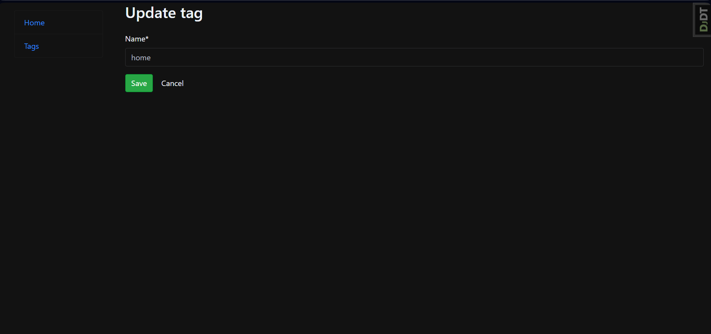

# TODO-list

Task management tool. Supports setting deadlines and adding tags.

## Table of Contents
1. [ Introduction. ](#introduction)
2. [ Technologies Used. ](#technologies-used)
3. [ DB Structure. ](#db-structure)
4. [ Getting Started. ](#getting-started)
5. [ Shutdown ](#shutdown)
6. [ Accessing the Application. ](#accessing-the-application)
7. [ Demo. ](#demo)
8. [ Contributing. ](#contributing)

## Introduction

The Project management platform is a web application designed to track tasks. Uncompleted tasks are displayed at the top of the list.

Users can set create new and update existing tasks, delete ones that no longer have to be completed and mark them as "done" or "not done". Tag system allows to add basic information about the task in a fast and easy way.

## Technologies Used

- Python and Django Framework for the backend
- HTML, CSS, and JavaScript for the frontend
- SQLite database for data storage

## DB Structure


## Getting Started

### Prerequisites
* Python (version 3.6 or higher) and pip installed on your system
* Git (optional, for cloning the repository)

### Installation
1. Clone the repository:
```
git clone https://github.com/your-username/to-do-list.git
cd project-management-platform
```

2. Create a virtual environment (optional but recommended):
```
python -m venv env
source env/bin/activate      
# For Windows: env\Scripts\activate
```
3.  Edit the `.env` using the template `env.sample`.

```
# True for development, False for production
DJANDO_DEBUG=True
```

4. Install dependencies:
```
pip install -r requirements.txt
```

5. Run database migrations:
```
python manage.py migrate
```

6. Start the development server:
```
python manage.py runserver
```

7. Open your web browser and navigate to http://localhost:8000/.

## Shutdown
To stop running app in your terminal press:
```
ctrl + C
```

## Accessing the Application
The Django application is accessible at http://localhost:8000/

Remember to replace `localhost` with the relevant IP address if you're not accessing these from the same machine where the services are running.

## Demo

Task views


Tag views





## Contributing
I welcome contributions to improve the Newspaper Redactor Tracking System. Feel free to submit bug reports, feature requests, or pull requests to `v.krasnovyd@gmail.com`
